# Every 2×2 game, counted

*An exhaustive computational tour of pure-strategy Nash equilibria*

*Alex Lewis Dunstan · [ORCID: 0009-0007-7869-809X](https://orcid.org/0009-0007-7869-809X)*

## Why I built this

Game theory textbooks prove things. They tell you a 2×2 game has at most so many
equilibria, that the Prisoner's Dilemma has a dominant-strategy outcome, that some
games have no pure equilibrium at all. The proofs are clean but abstract - you never
see what the *whole space* of games actually looks like.

So I brute-forced it. I generated every possible 2×2 payoff matrix over a fixed
integer range, checked each one for Nash equilibria, classified it, and measured the
results. No sampling, no theory - just enumerate everything and count.

The main deliverable is an interactive tool where you can type in any payoff matrix
and instantly see its equilibria and game type. This write-up is what the data looks
like in aggregate.

---

## The object: payoff matrices and Nash equilibria

A payoff matrix is the basic unit of two-player strategic-form game theory. Rows are
Player 1's strategies, columns are Player 2's. Each cell holds two numbers - what each
player gets when they pick that row/column combination.

```
              Col 0        Col 1
Row 0     (3, 3)       (0, 5)
Row 1     (5, 0)       (1, 1)   ← Nash equilibrium
```

A **pure-strategy Nash equilibrium** is a cell where neither player can do better by
unilaterally switching. Above (the Prisoner's Dilemma), Row 1 / Col 1 is the only one:
either player switching drops their payoff from 1 to 0.

## The method

Enumerate every cell-value combination. For 2×2 matrices with payoffs in 0-5, each of
the four cells holds a pair of values from {0..5}, so there are 6^2 = 36 possibilities
per cell and **36^4 = 1,679,616 distinct matrices**. Each gets checked for equilibria
and tagged with structural properties.

### One thing worth stating up front: only the ranking matters

Pure-strategy equilibria depend on the *ordinal ranking* of payoffs, not the absolute
numbers. A matrix with payoffs in 0-5 and one in 3-8 with the same relative ordering
are strategically identical - shifting everything by a constant changes nothing.

That means these integer ranges are really a **discrete sampling of the continuous
payoff space**. The fractions I measure here (what % of games have an equilibrium, etc.)
are empirical estimates of the probabilities studied analytically in the *random games*
literature (Goldberg, Goldman & Newman; Rinott & Scarsini). I'm not proving anything new
- I'm computing what those theoretical quantities actually look like at scale.

---

## How many equilibria does a game have?

The headline number: in the 0-5 range, **94% of all 2×2 games have at least one pure
equilibrium**. Most have exactly one.

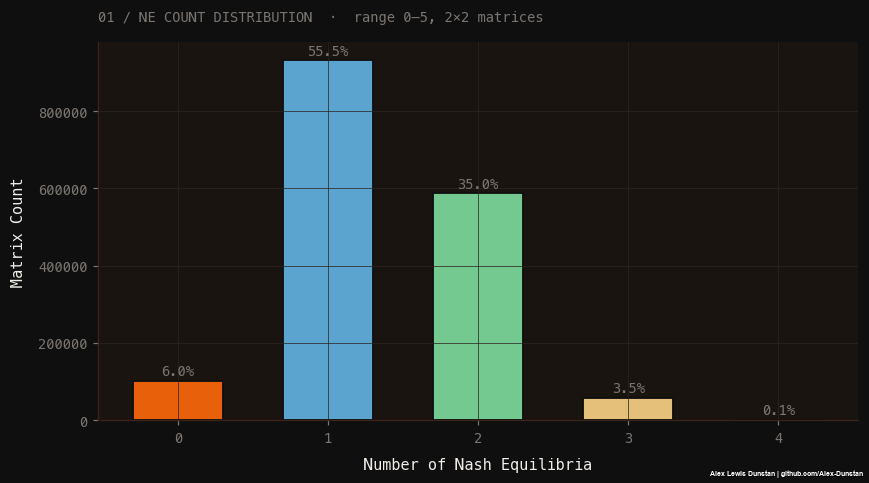

| Equilibria | Matrices | Share |
|-----------:|---------:|------:|
| 0 | 101,250 | 6.03% |
| 1 | 931,500 | 55.46% |
| 2 | 587,250 | 34.96% |
| 3 | 58,320 | 3.47% |
| 4 | 1,296 | 0.08% |

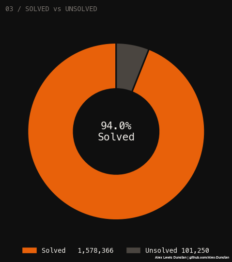

The 6% with no pure equilibrium are exactly the games that need mixed strategies - I
come back to those below.

### Does the payoff at one cell predict the equilibrium count?

Grouping by the top-left cell's payoff pair and averaging the equilibrium count shows a
clear gradient - the values in a single cell already shift the expected number of
equilibria.

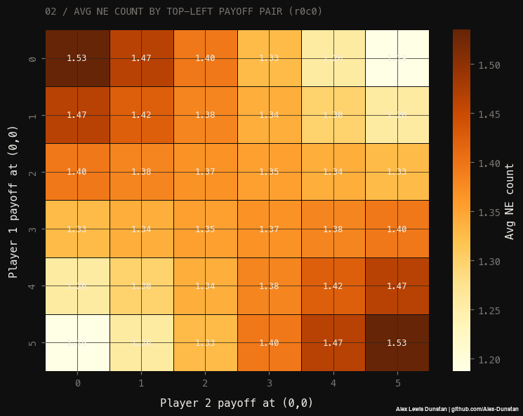

---

## What happens as the range widens?

Here's the first genuinely interesting result. As you widen the payoff range, the
fraction of games with a pure equilibrium goes **down**:

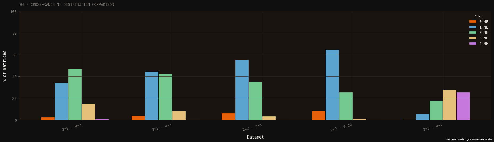

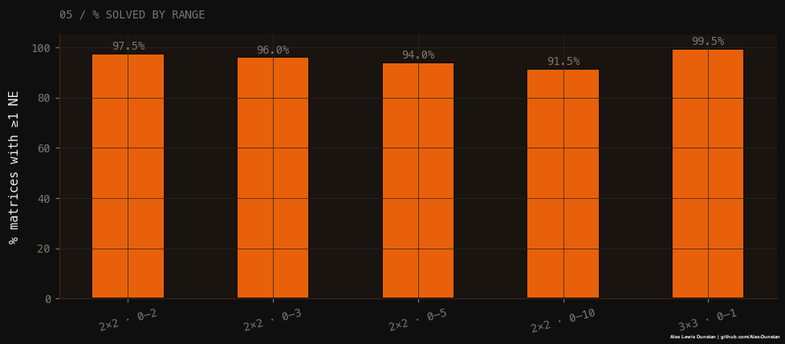

| Range | Matrices | % with pure NE |
|------:|---------:|---------------:|
| 0-2 | 6,561 | 97.53% |
| 0-3 | 65,536 | 96.04% |
| 0-5 | 1,679,616 | 93.97% |
| 0-10 | 214,358,881 | 91.46% |

The mechanism is ties. With a narrow range, lots of payoffs collide, and ties tend to
*create* equilibria (a weakly-best response is still a best response). Widen the range,
ties get rarer, and the equilibrium rate falls toward its continuous-payoff limit. That
limit - the probability a random 2×2 game with continuous payoffs has a pure
equilibrium - is exactly the kind of constant the random-games literature derives
analytically. My 91.46% at 0-10, still trending down, is the discrete approximation
creeping toward it.

*(The 0-10 row has 214 million matrices. The raw file is ~8 GB, too big to load into the
notebook, so its summary stats come from a pre-computed pass.)*

---

## What kind of game is it?

Counting equilibria is one thing; naming the game is another. A label like "Prisoner's
Dilemma" carries a whole theorem - dominant strategies, a socially suboptimal outcome,
cooperation that needs enforcement. I classify each matrix by its structural properties
(dominant strategies, zero-sum, symmetry, Pareto efficiency of the equilibrium) and
derive a named type.

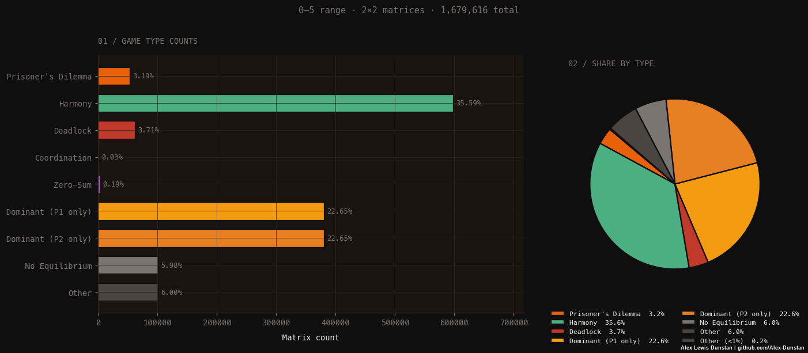

In the 0-5 range, the breakdown is dominated by benign games:

| Game type | Share |
|-----------|------:|
| Harmony | 35.6% |
| Dominant (P1 only) | 22.6% |
| Dominant (P2 only) | 22.6% |
| Other | 6.0% |
| No Equilibrium | 6.0% |
| Deadlock | 3.7% |
| Prisoner's Dilemma | 3.2% |
| Zero-Sum | 0.19% |
| Coordination | 0.03% |

The famous games are the rare ones. Prisoner's Dilemma is ~3%, true Coordination games
are 3 in 10,000. Most random games are "Harmony" - the equilibrium is also the socially
best outcome and there's no dilemma at all.

### The mix shifts with the range

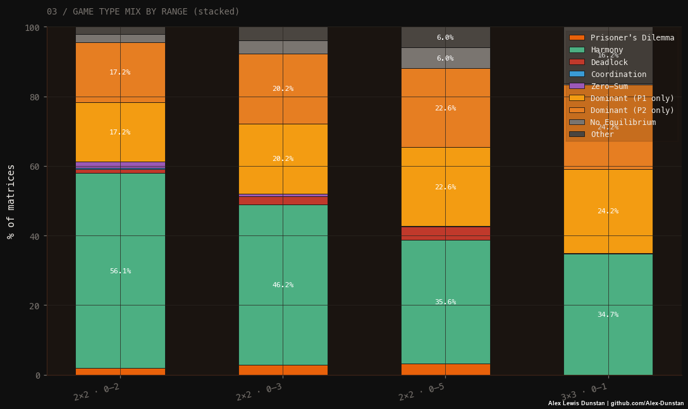

As the range widens, Harmony shrinks and the dominant-strategy games grow. A
chi-squared test confirms the distributions genuinely differ across ranges:

```
chi^2 = 71,679.69
df    = 24
p     ≈ 0
Cramér's V = 0.1089  (moderate effect)
```

With exhaustive data, the p-value is meaningless - every difference is real by
construction since there's no sampling. The number that matters is **Cramér's V**, the
effect size: 0.11 says the range *does* change the mix, but moderately, not dramatically.

---

## Is the equilibrium any good?

A Nash equilibrium is stable, not necessarily *good*. Two ways to measure that:

**Pareto efficiency** - is there another outcome that's better for both players? If so,
the equilibrium leaves value on the table.

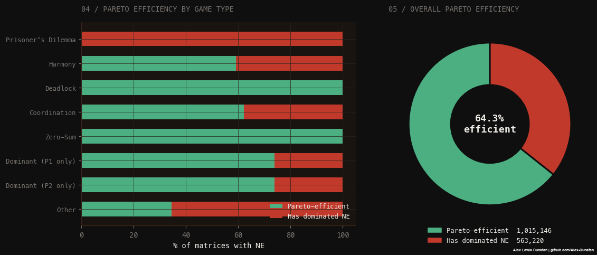

64.3% of games with an equilibrium have one that's Pareto-efficient. The rest - 35.7% -
have an equilibrium that both players would happily trade away if they could coordinate.
Prisoner's Dilemma is the extreme case: 0% efficient, by definition.

**Welfare loss** - quantify the gap. How much total payoff is lost at the equilibrium
versus the best possible outcome?

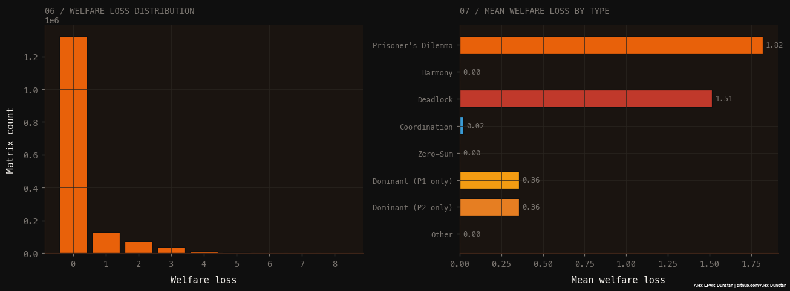

84% of games lose nothing - the equilibrium is socially optimal. The damage is
concentrated in two game types: Prisoner's Dilemma (mean loss 1.82) and Deadlock (1.51).
Everything else is near zero. The social-dilemma problem is real but rare.

---

## The 6% with no pure equilibrium

For the 101,250 games with no pure equilibrium, Nash's theorem guarantees a
mixed-strategy one exists - each player randomizes to keep the other indifferent. Every
single one of them resolved to a valid mixed equilibrium; none were degenerate.

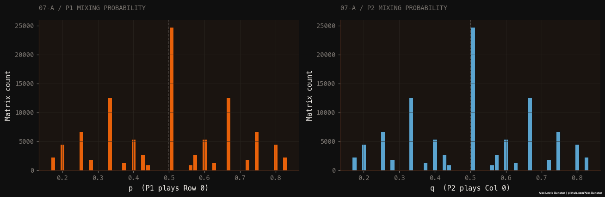

The mixing probabilities cluster hard at 0.5 (median p = median q = 0.5) - the symmetric
games push both players to a coin flip - with secondary spikes at simple fractions like
1/3 and 2/3.

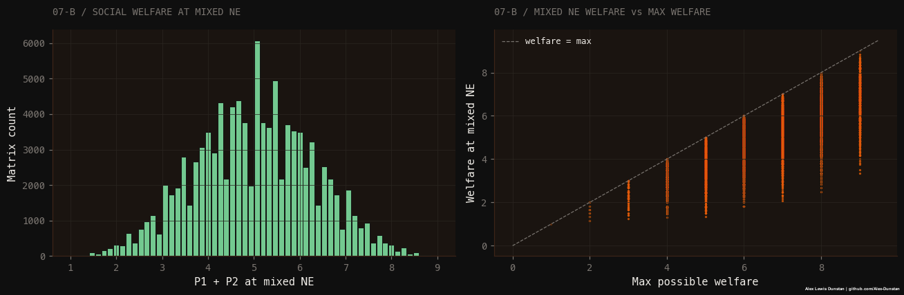

Mixed equilibria are costlier than pure ones: mean welfare loss 1.64, and only 0.7%
hit the social optimum. Randomizing because you have to is rarely efficient.

---

## Is the equilibrium fair?

Last question: when players reach an equilibrium, do they walk away with equal payoffs?
"Stable" says nothing about "fair."

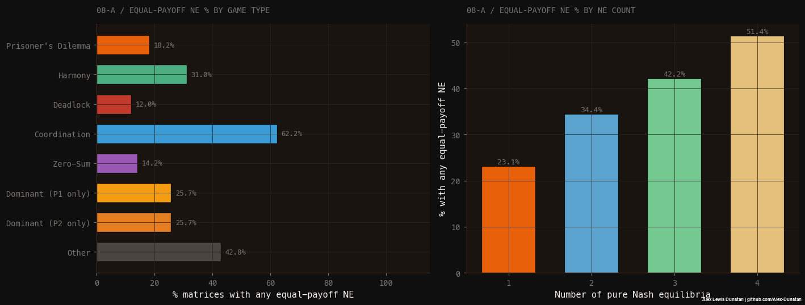

Across all games with an equilibrium, 28% have one where both players score equally. It
varies enormously by type:

| Game type | Equal-payoff NE |
|-----------|----------------:|
| Coordination | 62.2% |
| Other | 42.8% |
| Harmony | 31.0% |
| Dominant (either) | 25.7% |
| Prisoner's Dilemma | 18.2% |
| Zero-Sum | 14.2% |
| Deadlock | 12.0% |

Coordination games are the fairest (players succeed or fail together); zero-sum and
deadlock the least (one player's gain is the other's loss).

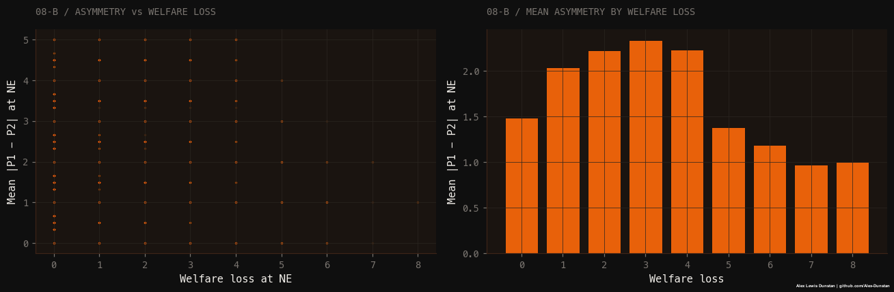

There's a weak positive correlation between payoff asymmetry and welfare loss
(Pearson r = 0.18) - unfair equilibria tend to be slightly more wasteful - but it's not
a strong link.

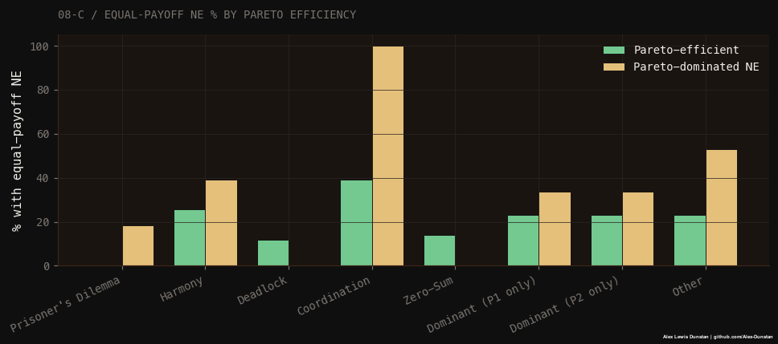

---

## What this is and isn't

**It isn't novel research.** Equilibrium existence probabilities, the game-type
taxonomy, the welfare results - all of this is known theoretically. The random-games
literature derived the asymptotics decades ago.

**The "correct" enumeration would be smaller.** Since only ordinal ranking matters,
the strategically distinct 2×2 games number in the hundreds, not millions. My integer
datasets are massively redundant - every ordinal type appears thousands of times with
different labels. Building the ordinal-permutation set is the obvious next step.

**Coverage is uneven.** 2×2 goes up to 0-10 (214M matrices); 3×3 only to 0-1 so far.
The enriched 0-10 file is 24 GB, which is why the deeper analysis stops at 0-5.

What it *is* is a complete, explorable picture of a space that's usually only described
in proofs - and a tool anyone can use to see where any given game sits in it. The
empirical numbers line up with the theory, which is its own kind of confirmation.

---

## Citation

> Dunstan, A. L. (2026). *Every 2x2 game, counted: An exhaustive computational tour of pure-strategy Nash equilibria.* Game Theory Matrix Finder. https://github.com/Alex-Dunstan/game-theory-matrix-finder

Author ORCID: [0009-0007-7869-809X](https://orcid.org/0009-0007-7869-809X). The project software citation is maintained in [`CITATION.cff`](../CITATION.cff); cite the [Hugging Face dataset](https://huggingface.co/datasets/AlexDunstan/nash-equilibria-matrices) separately when using its data.
